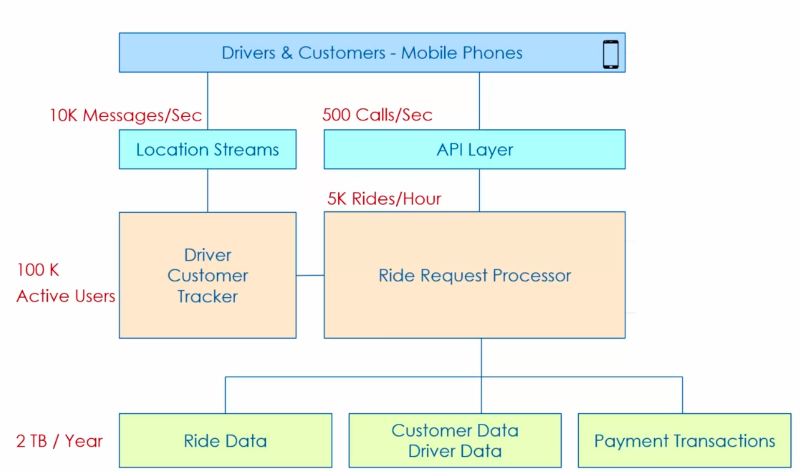
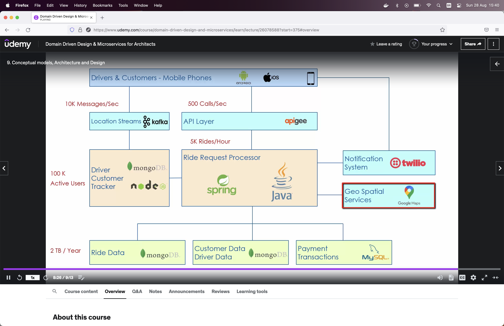
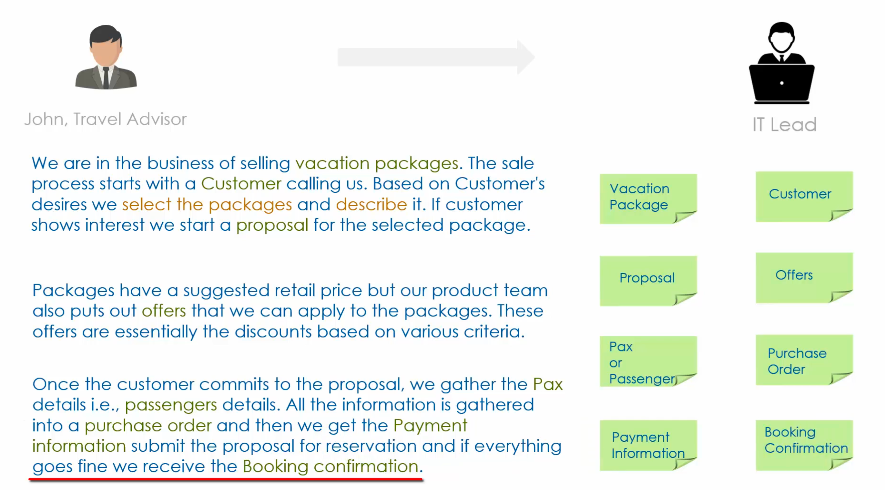
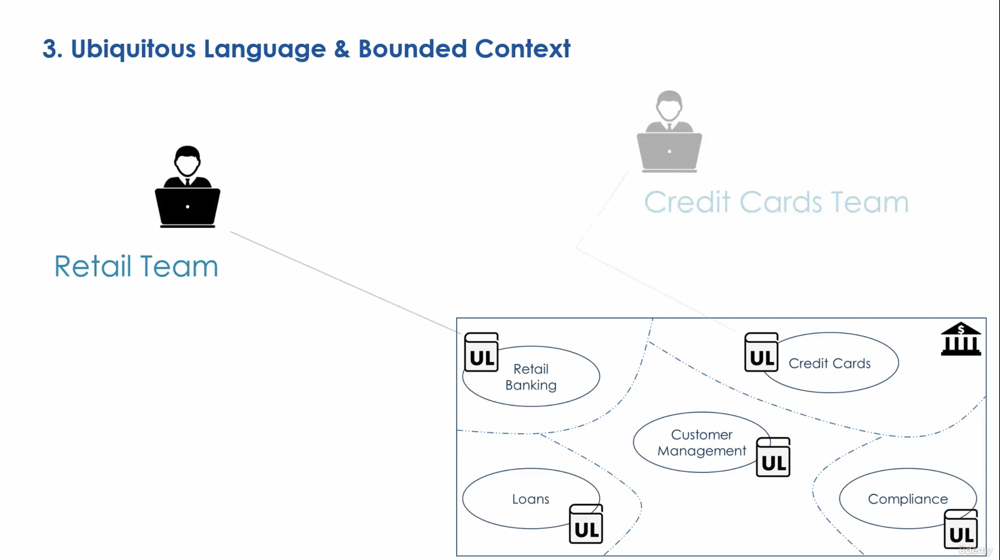

= Domain Driven Design & Microservices for Architects

== Understanding Domain

* Domain Field Perspective, represents a kind of industry in which the business operate

. Banking
. Oil & Gas
. Health Care

*  Domain Software Perspective, represents the problem space

. eCommerce
. Social Media
. Means of Payment

* Each domain consists of Sub-domains

. Banking
.. Loans Account
.. Retails Account
.. Merchants Account

* Domain Experts

. *No one experts* knows everything about the domain

* Conceptual Models

. A representation of a System made from composition of concepts

== Architecture vs Design

.Quick Architecture View

.Quick Design View

== DDD: Strategic Patterns

. Strategic Pattern
.. Divide a complex & large business problem into smaller chunks with well defined boundaries

. Tactical Pattern
.. Translate of the conceptual models to software application | services design e.g, classes, modules

.Sub-domain Complexity
.. Each sub-domain has a different level of complexity

. Sub-domains are specific to the Enterprise
.. There are three types of Domains, *_Generic|Core|Supporting_*

.Sub-domain granularity
.. Retail Accounts _[Saving Account, Checking Accounts, Certificate of Deposit, Ledger & Accounting, Retail Banking Compliance]_

. Ubiquitous Language is a common language within each business context, guided by a business dictionary, Confluence can be a good choice for keep this UL.

.Ubiquitous Language based on Domain Expert Interview

.Ubiquitous Language and Bounded Contexts

== Bounded Contexts

. Represents in a common domain model a intended used across the enterprise, e.g a Customer needs interact with Retail Banking, Loans etc, a Customer Management can be classified as Bounded Context
. Bounded Contexts can group Retail Banking, Customer Management, Credit Cards etc
. Each BC represents its OWN domain model
. There's no an exact process to discovery BCs
. For imaginary travel company we can have Areas/BC such as _Marketing, Product Management, Sales, Support etc_

